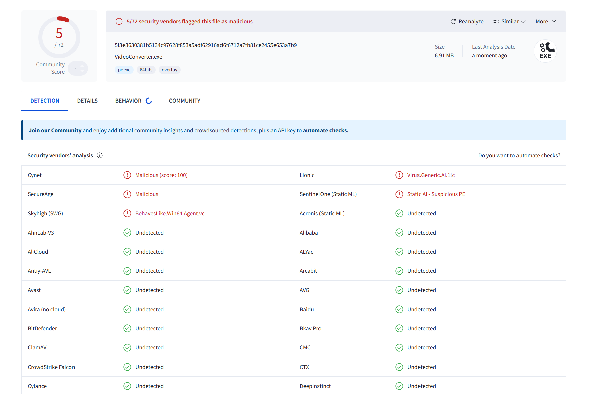

# 動画変換ツール

Copyright (c) 2024 led-mirage

## 概要

指定の解像度に動画を変換するツールです。また、動画から音声を抽出することもできます。
動画コーデックは H264、音声コーデックは AAC、音声抽出モードの場合は mp3 を使用します。
NVIDIA の GPU が利用可能な場合には自動的に使用します。

## 特徴

1. **多階層フォルダ対応**:
    - 入力フォルダが多階層になっていても、階層構造を保ちながら動画ファイルを変換し、出力を行うことができます。

2. **GPUサポート**:
    - NVIDIA GPUが利用可能な場合、自動的にNVENCを使用して高速エンコードを行います。これにより、変換速度が大幅に向上することが期待できます。

3. **柔軟な入力手順**:
    - ユーザーが指定する動画の高さをインタラクティブに入力する方式を採用。特定の要件に応じた柔軟な変換が可能です。

4. **出力ディレクトリのクリア機能**:
    - 出力フォルダをクリアしてから変換を行うため、古いファイルが混在することなく常に整理された状態で作業を進めることができます。

5. **システムに柔軟に対応**:
    - システムのパスにFFmpegが含まれている場合や、指定の`bin`フォルダ内にFFmpegが配置されている場合に対応。適切なFFmpegパスを自動的に選択します。

6. **多形式対応の変換**:
    - `.mp4`, `.avi`, `.mkv`, `.flv`, `.mov`, `.wmv` など、一般的な動画形式に対応して高品質な動画と音声の変換を実現します。

7. **音声抽出機能**:
    - 動画ファイルからmp3形式で音声を抽出することができます。

8. **幅広いデバイスに対応**:
    - コーデックにH.264とAACを使用しているので、幅広いデバイスやプラットフォームに適合します。

## 使用方法

1. **入力フォルダに動画ファイルを配置**
    - `01.入力` フォルダに変換したい動画ファイルを配置します。

2. **プログラムの実行**
    - 解像度変更モード（デフォルト）:
      1. プログラムを実行すると、変換後の動画解像度の高さが求められます。
      2. 高さを入力して Enter キーを押します。
    - 音声抽出モード:
      1. `--mode extract` オプションをつけてプログラムを実行します。
      2. `音声抽出を開始しますか？ (y/n):` と表示されるので、`y`を入力して音声抽出を開始します。

3. **出力動画の確認**
    - 変換された動画ファイルは `02.出力` フォルダに出力されます。

## インストール

1. **FFmpegのインストール**
    - [FFmpeg公式サイト](https://ffmpeg.org/download.html)からFFmpegをダウンロードしてインストールします。
    - `ffmpeg.exe`ファイルを `bin` フォルダに配置します。
    - ※既にシステムのパスにFFmpegが含まれている場合は、`bin` フォルダに配置する必要はありません。

2. **必要なPythonライブラリのインストール**
    - Pythonがインストールされている必要があります。
    - 必要なライブラリをインストールします（特に追加のライブラリは必要ありませんが、Pythonの標準ライブラリを使用しています）。

## フォルダ構造

```
プロジェクトフォルダ/
 ├─ bin/ 
 │ └─ ffmpeg.exe（ここにFFmpegがあれば、これが優先的に使用される）
 ├─ 01.入力/
 │ └─ （変換したい動画ファイルをここに配置）
 ├─ 02.出力/ 
 │ └─ （変換された動画ファイルがここに出力されます）
 ├─ main.py（または、VideoConverter.exe）
 └─ 音声抽出.bat
 └─ 解像度変換.bat
```

## コマンド例（VideoConverter.exeを使用する場合）

### 解像度変更モード（デフォルト）

```sh
解像度変換.bat

または

VideoConverter --mode convert
```

### 音声抽出モード

```sh
音声抽出.bat

または

VideoConverter --mode extract
```

## コマンド例（Pythonで実行する場合）

### 解像度変更モード（デフォルト）

```sh
python main.py --mode convert

または

python main.py
```

### 音声抽出モード

```sh
python main.py --mode extract
```

## 動作確認環境

- OS: Windows 11 Pro 23H2  
- Python: 3.12.0  

## 注意事項

### ⚡ ウィルス対策ソフトの誤認問題

このプログラムの実行ファイル（VideoConverter.exe）は PyInstaller というライブラリを使って作成していますが、ウィルス対策ソフトにマルウェアと誤認されることがあります。

もちろん、このアプリに悪意のあるプログラムは入っていませんが、気になる人は上記の「Pythonで実行する方法」で実行してください。

誤認問題が解決できるのが一番いいのですが、いい方法が見つかっていないので申し訳ありませんがご了承ください。

VirusTotalでのチェック結果は以下の通りです（2024/11/09 v1.0）

- VideoConverter.exe … 72個中5個のアンチウィルスエンジンで検出



## ライセンス

© 2024 led-mirage

このプロジェクトはMITライセンスのもとで公開されています。詳細はLICENSEファイルをご覧ください。
